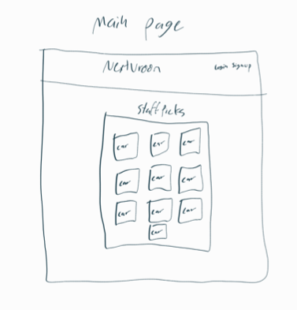
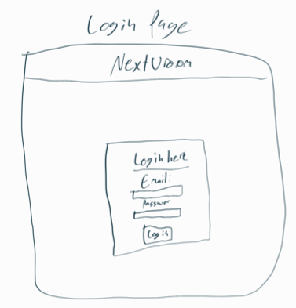
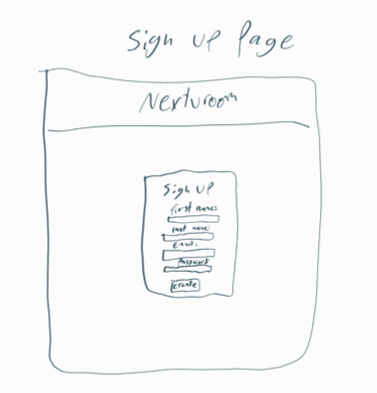
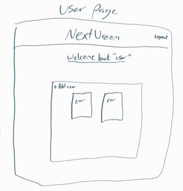
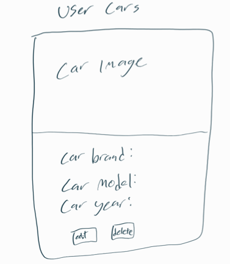

# NextVroom

check out my CRUD app [NextVroom](https://shielded-wave-21272.herokuapp.com)

This project allows users to create a private database to save cars to their own list of cars. Just by inputing the brand, model and year it will automatically come with a picture of that car. 

## My plan / approach
To start off with the basics
1. Add two databases
2. Get sign-up and login working
3. Create form to take in user input and store it in the database
4. connect to an API to load the images
5. Tidy up the code
6. CSS time

## Cool tech that I used
1. Working with XML data
2. Foreign keys in postgress 
3. API to get the images for the cars without needing to put in a link

## Lessons you learned
1. Improving with my CSS flexbox
2. How to add in a Foreign key to my tables. 
3. Using global variable to manage logins

## Features to add in the future
1. Getting an API that has the car specs in it such as top speed, doors, seats. 
2. A way to share your list to another users. 

## Wireframes 

